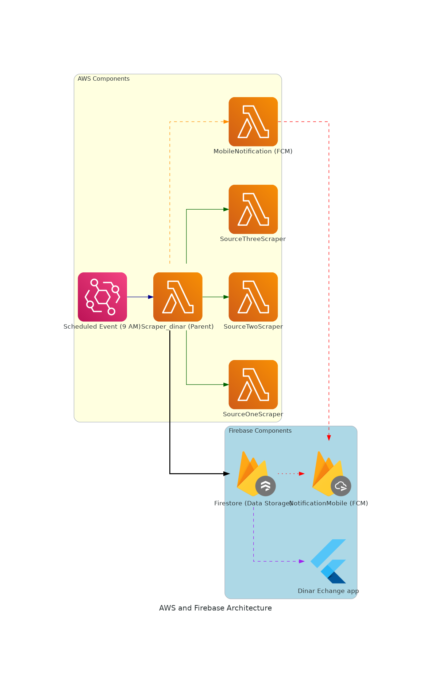

# Backend Architecture for Dinar Exchange Rates App

## Overview
This backend system is designed to manage the daily tasks of scraping exchange rates, processing the data, storing it, and sending notifications to users of the Dinar Exchange Rates App. It uses services from AWS and Firebase to ensure everything runs smoothly and efficiently.

## How It Works

How It Works

1. Daily Trigger:
Every day at 9 AM, an AWS service called EventBridge starts the process by triggering the main function, Scraper_dinar.
2. Scraping Data: Scraper_dinar is the main function that controls everything. It calls three other functions—SourceOneScraper, SourceTwoScraper, and SourceThreeScraper—to collect exchange rate data from different sources.

3. Processing and Storing Data:
After collecting the data, Scraper_dinar processes it and stores the final results in a Firebase database called Firestore.

4. Sending Notifications:
Once the data is stored, another function called MobileNotification sends notifications to users using Firebase Cloud Messaging (FCM). This keeps users informed about the latest exchange rates.
User Access:

The Dinar Exchange Rates App (built with Flutter) retrieves the stored data from Firestore and displays it to the users.
Diagram

